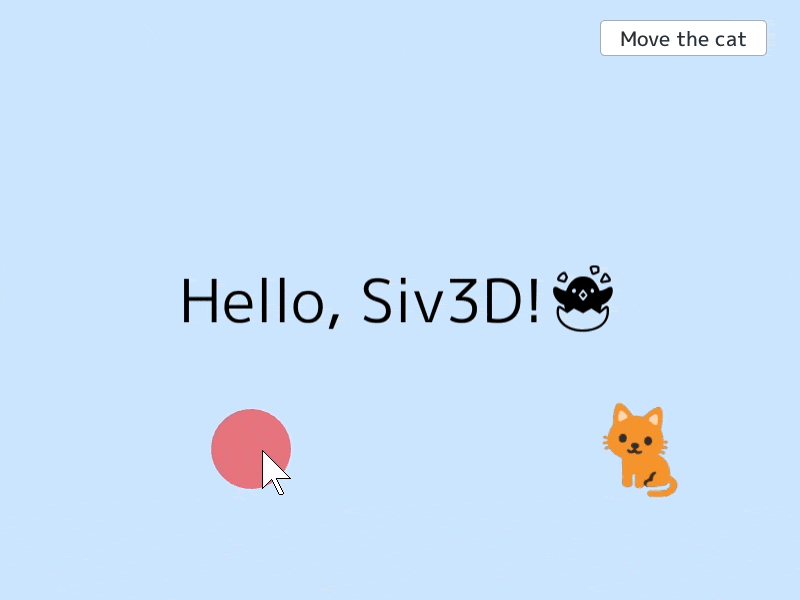
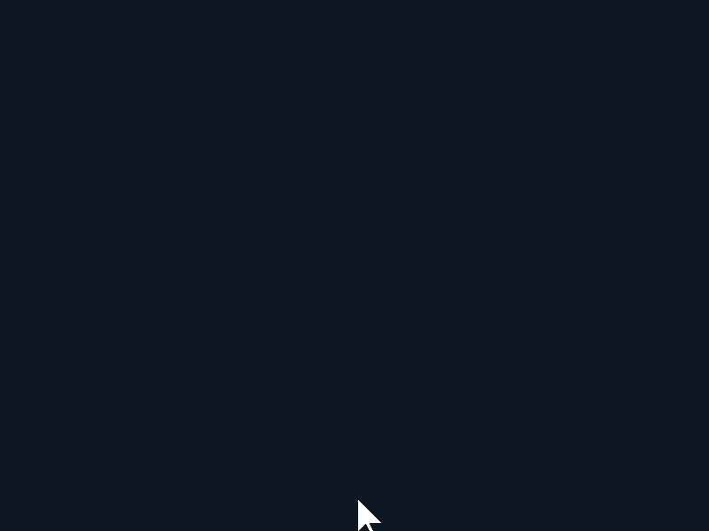
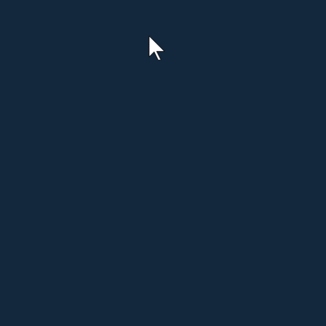
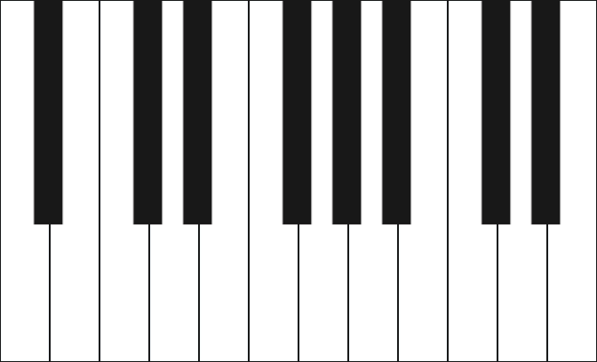
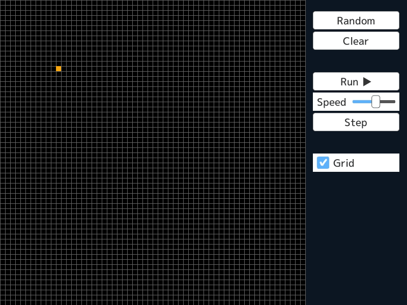

<h1>OpenSiv3D <a href="http://doge.mit-license.org"></a> <a href="https://siv3d-slackin.herokuapp.com/">  </a></h1>

**OpenSiv3D** is a C++17 framework for creative coding.  

## Installation Guide & Documentation

- English: https://siv3d.github.io/
- 日本語: https://siv3d.github.io/ja-jp/

## SDK Downloads

| Platform        | Version        | Date       | Requirements                  |
|:---------------:|:---------------:|:-------------:|:------------------------------|
| Windows | [**0.4.1**](https://siv3d.github.io/#getting-started) | 02 October 2019 | - Windows 7 SP1 / 8.1 / 10 (64-bit)<br>- Microsoft Visual C++ 2019 16.3<br>- Windows 10 SDK |
| macOS           | [**0.4.1**](https://siv3d.github.io/#getting-started) | 02 October 2019 | - macOS High Sierra v10.13 or newer<br>- Xcode 10.1 or newer<br>- OpenGL 4.1 compatible graphics card |
| Linux           | [**0.4.1**](https://siv3d.github.io/#getting-started)* | 02 October 2019 | - Tested compilers: Clang 8.0.0 / GCC 8.3.0<br>- OpenGL 4.1 compatible graphics card |
| iOS | TBA  |  |  |

<small>* Some functionality may be missing or limited</small>

## Examples

### Hello, Siv3D!



```C++
# include <Siv3D.hpp>

void Main()
{
    // Set background color to sky blue
    Scene::SetBackground(ColorF(0.8, 0.9, 1.0));

    // Create a new font
    const Font font(60);

    // Create a new texture that contains a cat emoji
    const Texture cat(Emoji(U"🐈"));

    // Coordinates of the cat
    Vec2 catPos(640, 450);

    while (System::Update())
    {
        // Put a message in the middle of the screen
        font(U"Hello, Siv3D!🐣").drawAt(Scene::Center(), Palette::Black);

        // Display the texture with animated size
        cat.resized(100 + Periodic::Sine0_1(1s) * 20).drawAt(catPos);

        // Draw a translucent red circle that follows the mouse cursor
        Circle(Cursor::Pos(), 40).draw(ColorF(1, 0, 0, 0.5));

        // When [A] key is down
        if (KeyA.down())
        {
            // Print `Hello!`
            Print << U"Hello!";
        }

        // When [Move the cat] button is pushed
        if (SimpleGUI::Button(U"Move the cat", Vec2(600, 20)))
        {
            // Move the cat's coordinates to a random position in the screen
            catPos = RandomVec2(Scene::Rect());
        }
    }
}
```

### Breakout



```C++
# include <Siv3D.hpp>

void Main()
{
    // ブロックのサイズ
    constexpr Size blockSize(40, 20);

    // ブロックの配列
    Array<Rect> blocks;

    // 横 (Scene::Width() / blockSize.x) 個、縦 5 個のブロックを配列に追加する
    for (auto p : step(Size((Scene::Width() / blockSize.x), 5)))
    {
        blocks << Rect(p.x * blockSize.x, 60 + p.y * blockSize.y, blockSize);
    }

    // ボールの速さ
    constexpr double speed = 480.0;

    // ボールの速度
    Vec2 ballVelocity(0, -speed);

    // ボール
    Circle ball(400, 400, 8);

    while (System::Update())
    {
        // パドル
        const Rect paddle(Arg::center(Cursor::Pos().x, 500), 60, 10);

        // ボールを移動
        ball.moveBy(ballVelocity * Scene::DeltaTime());

        // ブロックを順にチェック
        for (auto it = blocks.begin(); it != blocks.end(); ++it)
        {
            // ボールとブロックが交差していたら
            if (it->intersects(ball))
            {
                // ボールの向きを反転する
                (it->bottom().intersects(ball) || it->top().intersects(ball) ? ballVelocity.y : ballVelocity.x) *= -1;

                // ブロックを配列から削除（イテレータが無効になるので注意）
                blocks.erase(it);

                // これ以上チェックしない  
                break;
            }
        }

        // 天井にぶつかったらはね返る
        if (ball.y < 0 && ballVelocity.y < 0)
        {
            ballVelocity.y *= -1;
        }

        // 左右の壁にぶつかったらはね返る
        if ((ball.x < 0 && ballVelocity.x < 0) || (Scene::Width() < ball.x && ballVelocity.x > 0))
        {
            ballVelocity.x *= -1;
        }

        // パドルにあたったらはね返る
        if (ballVelocity.y > 0 && paddle.intersects(ball))
        {
            // パドルの中心からの距離に応じてはね返る向きを変える
            ballVelocity = Vec2((ball.x - paddle.center().x) * 10, -ballVelocity.y).setLength(speed);
        }

        // すべてのブロックを描画する
        for (const auto& block : blocks)
        {
            block.stretched(-1).draw(HSV(block.y - 40));
        }

        // ボールを描く
        ball.draw();

        // パドルを描く
        paddle.draw();
    }
}
```


### Kaleidoscope sketch



```C++
# include <Siv3D.hpp>

void Main()
{
    // キャンバスのサイズ
    constexpr Size canvasSize(600, 600);

    // 分割数
    constexpr int32 N = 12;

    // 背景色
    constexpr Color backgroundColor(20, 40, 60);

    // ウィンドウをキャンバスのサイズに
    Window::Resize(canvasSize);

    // 書き込み用の画像
    Image image(canvasSize, backgroundColor);

    // 画像を表示するための動的テクスチャ
    DynamicTexture texture(image);

    while (System::Update())
    {
        if (MouseL.pressed())
        {
            // 画面の中心が (0, 0) になるようにマウスカーソルの座標を移動
            const Vec2 begin = (MouseL.down() ? Cursor::PosF() : Cursor::PreviousPosF()) - Scene::Center();
            const Vec2 end = Cursor::PosF() - Scene::Center();

            for (auto i : step(N))
            {
                // 円座標に変換
                std::array<Circular, 2> cs = { begin, end };

                for (auto& c : cs)
                {
                    // 角度をずらす
                    c.theta = IsEven(i) ? (-c.theta - 2_pi / N * (i - 1)) : (c.theta + 2_pi / N * i);
                }

                // ずらした位置をもとに、画像に線を書き込む
                Line(cs[0], cs[1]).moveBy(Scene::Center())
                    .paint(image, 2, HSV(Scene::Time() * 60.0, 0.5, 1.0));
            }

            // 書き込んだ画像でテクスチャを更新
            texture.fillIfNotBusy(image);
        }
        else if (MouseR.down()) // 右クリックされたら
        {
            // 画像を塗りつぶす
            image.fill(backgroundColor);

            // 塗りつぶした画像でテクスチャを更新
            texture.fill(image);
        }

        // テクスチャを描く
        texture.draw();
    }
}
```


### Piano



```C++
# include <Siv3D.hpp>

void Main()
{
    // 白鍵の大きさ
    constexpr Size keySize(55, 400);

    // 楽器の種類
    constexpr GMInstrument instrument = GMInstrument::Piano1;

    // ウインドウをリサイズ
    Window::Resize(12 * keySize.x, keySize.y);

    // 鍵盤の数
    constexpr int32 NumKeys = 20;

    // 音を作成
    std::array<Audio, NumKeys> sounds;
    for (auto i : step(NumKeys))
    {
        sounds[i] = Audio(Wave(instrument, static_cast<uint8>(PianoKey::A3 + i), 0.5s));
    }

    // 対応するキー
    constexpr std::array<Key, NumKeys> keys =
    {
        KeyTab, Key1, KeyQ,
        KeyW, Key3, KeyE, Key4, KeyR, KeyT, Key6, KeyY, Key7, KeyU, Key8, KeyI,
        KeyO, Key0, KeyP, KeyMinus, KeyGraveAccent,
    };

    // 描画位置計算用のオフセット値
    constexpr std::array<int32, NumKeys> keyPositions =
    {
        0, 1, 2, 4, 5, 6, 7, 8, 10, 11, 12, 13, 14, 15, 16, 18, 19, 20, 21, 22
    };

    while (System::Update())
    {
        // キーが押されたら対応する音を再生
        for (auto i : step(NumKeys))
        {
            if (keys[i].down())
            {
                sounds[i].playOneShot(0.5);
            }
        }

        // 白鍵を描画
        for (auto i : step(NumKeys))
        {
            // オフセット値が偶数
            if (IsEven(keyPositions[i]))
            {
                RectF(keyPositions[i] / 2 * keySize.x, 0, keySize.x, keySize.y)
                    .stretched(-1).draw(keys[i].pressed() ? Palette::Pink : Palette::White);
            }
        }

        // 黒鍵を描画
        for (auto i : step(NumKeys))
        {
            // オフセット値が奇数
            if (IsOdd(keyPositions[i]))
            {
                RectF(keySize.x * 0.68 + keyPositions[i] / 2 * keySize.x, 0, keySize.x * 0.58, keySize.y * 0.62)
                    .draw(keys[i].pressed() ? Palette::Pink : Color(24));
            }
        }
    }
}
```


### Pinball


```C++
# include <Siv3D.hpp>

// 外周の枠の頂点リストを作成
Array<Vec2> CreateFrame(const Vec2& leftAnchor, const Vec2& rightAnchor)
{
    Array<Vec2> points = { leftAnchor, Vec2(-7, -2) };
    for (auto i : Range(-30, 30))
    {
        points << OffsetCircular(Vec2(0.0, -12.0), 7, i * 3_deg);
    }
    return points << Vec2(7, -2) << rightAnchor;
}

// 接触しているかに応じて色を決定
ColorF GetColor(const P2Body& body, const Array<P2BodyID>& list)
{
    return list.includes(body.id()) ? Palette::White : Palette::Orange;
}

void Main()
{
    // フレームレートを 60 に固定
    Graphics::SetTargetFrameRateHz(60);
    // フレームレートに依存しない、物理シミュレーションの更新
    constexpr double timeDelta = 1.0 / 60.0;

    // 背景色を設定
    Scene::SetBackground(ColorF(0.2, 0.3, 0.4));

    // 物理演算用のワールド
    P2World world(6.0);

    // 左右フリッパーの軸の座標
    constexpr Vec2 leftFlipperAnchor(-2.5, 1), rightFlipperAnchor(2.5, 1);

    // 固定の枠
    Array<P2Body> frames;
    // 外周
    frames << world.createStaticLineString(Vec2(0, 0), LineString(CreateFrame(leftFlipperAnchor, rightFlipperAnchor)));
    // 左上の (
    frames << world.createStaticLineString(Vec2(0, 0), LineString(Range(-25, -10).map([=](int32 i) { return OffsetCircular(Vec2(0.0, -12.0), 5.5, i * 3_deg).toVec2(); })));
    // 右上の )
    frames << world.createStaticLineString(Vec2(0, 0), LineString(Range(10, 25).map([=](int32 i) { return OffsetCircular(Vec2(0.0, -12.0), 5.5, i * 3_deg).toVec2(); })));

    // バンパー
    Array<P2Body> bumpers;
    // ● x3
    bumpers << world.createStaticCircle(Vec2(0, -17), 0.5, P2Material(1.0, 1.0));
    bumpers << world.createStaticCircle(Vec2(-2, -15), 0.5, P2Material(1.0, 1.0));
    bumpers << world.createStaticCircle(Vec2(2, -15), 0.5, P2Material(1.0, 1.0));
    // ▲ x2
    bumpers << world.createStaticTriangle(Vec2(0, 0), Triangle(-6, -5, -4, -1.5, -6, -3), P2Material(1.0, 0.8));
    bumpers << world.createStaticTriangle(Vec2(0, 0), Triangle(6, -5, 6, -3, 4, -1.5), P2Material(1.0, 0.8));

    // 左フリッパー
    P2Body leftFlipper = world.createDynamicRect(leftFlipperAnchor, RectF(0.0, 0.04, 2.1, 0.45), P2Material(0.1, 0.0));
    // 左フリッパーのジョイント
    const P2PivotJoint leftJoint = world.createPivotJoint(frames[0], leftFlipper, leftFlipperAnchor).setLimits(-20_deg, 25_deg).setLimitEnabled(true);

    // 右フリッパー
    P2Body rightFlipper = world.createDynamicRect(rightFlipperAnchor, RectF(-2.1, 0.04, 2.1, 0.45), P2Material(0.1, 0.0));
    // 右フリッパーのジョイント
    const P2PivotJoint rightJoint = world.createPivotJoint(frames[0], rightFlipper, rightFlipperAnchor).setLimits(-25_deg, 20_deg).setLimitEnabled(true);

    // スピナー ＋
    const P2Body spinner = world.createDynamicRect(Vec2(-5.8, -12), SizeF(2.0, 0.1), P2Material(0.1, 0.0)).addRect(SizeF(0.1, 2.0), P2Material(0.01, 0.0));
    // スピナーのジョイント
    P2PivotJoint spinnerJoint = world.createPivotJoint(frames[0], spinner, Vec2(-5.8, -12)).setMaxMotorTorque(0.05).setMotorSpeed(0).setMotorEnabled(true);

    // 風車の |
    frames << world.createStaticLine(Vec2(0, 0), Line(-4, -6, -4, -4));
    // 風車の羽 ／
    const P2Body windmillWing = world.createDynamicRect(Vec2(-4, -6), SizeF(3.0, 0.2), P2Material(0.1, 0.8));
    // 風車のジョイント
    const P2PivotJoint windmillJoint = world.createPivotJoint(frames.back(), windmillWing, Vec2(-4, -6)).setMotorSpeed(240_deg).setMaxMotorTorque(10000.0).setMotorEnabled(true);

    // 振り子の軸
    const P2Body pendulumbase = world.createStaticDummy(Vec2(0, -19));
    // 振り子 ●
    P2Body pendulum = world.createDynamicCircle(Vec2(0, -12), 0.4, P2Material(0.1, 1.0));
    // 振り子のジョイント
    const P2DistanceJoint pendulumJoint = world.createDistanceJoint(pendulumbase, Vec2(0, -19), pendulum, Vec2(0, -12), 7);

    // エレベーターの上部 ●
    const P2Body elevatorA = world.createStaticCircle(Vec2(4, -10), 0.3);
    // エレベーターの床 －
    const P2Body elevatorB = world.createRect(Vec2(4, -10), SizeF(2.0, 0.2));
    // エレベーターのジョイント
    P2SliderJoint elevatorSliderJoint = world.createSliderJoint(elevatorA, elevatorB, Vec2(4, -10), Vec2(0, 1)).setLimits(0.5, 5.0).setLimitEnabled(true).setMaxMotorForce(10000).setMotorSpeed(-10);

    // ボール 〇
    const P2Body ball = world.createDynamicCircle(Vec2(-4, -12), 0.4, P2Material(0.05, 0.0));
    const P2BodyID ballID = ball.id();

    // エレベーターのアニメーション用ストップウォッチ
    Stopwatch sliderStopwatch(true);

    // 2D カメラ
    const Camera2D camera(Vec2(0, -8), 24.0);

    while (System::Update())
    {
        /////////////////////////////////////////
        //
        // 更新
        //

        // 振り子の抵抗
        pendulum.applyForce(Vec2(pendulum.getVelocity().x < 0.0 ? 0.01 : -0.01, 0.0));

        if (sliderStopwatch > 4s)
        {
            // エレベーターの巻き上げを停止
            elevatorSliderJoint.setMotorEnabled(false);
            sliderStopwatch.restart();
        }
        else if (sliderStopwatch > 2s)
        {
            // エレベーターの巻き上げ
            elevatorSliderJoint.setMotorEnabled(true);
        }

        // 左フリッパーの操作
        leftFlipper.applyTorque(KeyLeft.pressed() ? -80 : 40);

        // 右フリッパーの操作
        rightFlipper.applyTorque(KeyRight.pressed() ? 80 : -40);

        // 物理演算ワールドの更新
        world.update(timeDelta, 24, 12);

        // ボールと接触しているボディの ID を取得
        Array<P2BodyID> collidedIDs;
        for (auto [pair, collision] : world.getCollisions())
        {
            if (pair.a == ballID)
            {
                collidedIDs << pair.b;
            }
            else if (pair.b == ballID)
            {
                collidedIDs << pair.a;
            }
        }

        /////////////////////////////////////////
        //
        // 描画
        //

        // 描画用の Transformer2D
        const auto transformer = camera.createTransformer();

        // 枠の描画
        for (const auto& frame : frames)
        {
            frame.draw(Palette::Skyblue);
        }

        // スピナーの描画
        spinner.draw(GetColor(spinner, collidedIDs));

        // バンパーの描画
        for (const auto& bumper : bumpers)
        {
            bumper.draw(GetColor(bumper, collidedIDs));
        }

        // 風車の描画
        windmillWing.draw(GetColor(windmillWing, collidedIDs));

        // 振り子の描画
        pendulum.draw(GetColor(pendulum, collidedIDs));

        // エレベーターの描画
        elevatorA.draw(GetColor(elevatorA, collidedIDs));
        elevatorB.draw(GetColor(elevatorB, collidedIDs));

        // ボールの描画
        ball.draw(Palette::White);

        // フリッパーの描画
        leftFlipper.draw(Palette::Orange);
        rightFlipper.draw(Palette::Orange);

        // ジョイントの可視化
        leftJoint.draw(Palette::Red);
        rightJoint.draw(Palette::Red);
        spinnerJoint.draw(Palette::Red);
        windmillJoint.draw(Palette::Red);
        pendulumJoint.draw(Palette::Red);
        elevatorSliderJoint.draw(Palette::Red);
    }
}
```


### Game of life



```C++
# include <Siv3D.hpp>

// 1 セルが 1 バイトになるよう、ビットフィールドを使用
struct Cell
{
    bool previous : 1;
    bool current : 1;
};

// フィールドをランダムなセル値で埋める関数
void RandomFill(Grid<Cell>& grid)
{
    grid.fill({ 0,0 });

    // 境界のセルを除いて更新
    for (auto y : Range(1, grid.height() - 2))
    {
        for (auto x : Range(1, grid.width() - 2))
        {
            grid[y][x] = { 0, RandomBool(0.5) };
        }
    }
}

// フィールドの状態を更新する関数
void Update(Grid<Cell>& grid)
{
    for (auto& cell : grid)
    {
        cell.previous = cell.current;
    }

    // 境界のセルを除いて更新
    for (auto y : Range(1, grid.height() - 2))
    {
        for (auto x : Range(1, grid.width() - 2))
        {
            const int32 c = grid[y][x].previous;

            int32 n = 0;
            n += grid[y - 1][x - 1].previous;
            n += grid[y - 1][x].previous;
            n += grid[y - 1][x + 1].previous;
            n += grid[y][x - 1].previous;
            n += grid[y][x + 1].previous;
            n += grid[y + 1][x - 1].previous;
            n += grid[y + 1][x].previous;
            n += grid[y + 1][x + 1].previous;

            // セルの状態の更新
            grid[y][x].current = (c == 0 && n == 3) || (c == 1 && (n == 2 || n == 3));
        }
    }
}

// フィールドの状態を画像化する関数
void CopyToImage(const Grid<Cell>& grid, Image& image)
{
    for (auto y : step(image.height()))
    {
        for (auto x : step(image.width()))
        {
            image[y][x] = grid[y + 1][x + 1].current
                ? Color(0, 255, 0) : Palette::Black;
        }
    }
}

void Main()
{
    // フィールドのセルの数（横）
    constexpr int32 width = 60;

    // フィールドのセルの数（縦）
    constexpr int32 height = 60;

    // 計算をしない境界部分も含めたサイズで二次元配列を確保
    Grid<Cell> grid(width + 2, height + 2, { 0,0 });

    // フィールドの状態を可視化するための画像
    Image image(width, height, Palette::Black);

    // 動的テクスチャ
    DynamicTexture texture(image);

    Stopwatch s(true);

    // 自動再生
    bool autoStep = false;

    // 更新頻度
    double speed = 0.5;

    // グリッドの表示
    bool showGrid = true;

    // 画像の更新の必要があるか
    bool updated = false;

    while (System::Update())
    {
        // フィールドをランダムな値で埋めるボタン
        if (SimpleGUI::ButtonAt(U"Random", Vec2(700, 40), 170))
        {
            RandomFill(grid);
            updated = true;
        }

        // フィールドのセルをすべてゼロにするボタン
        if (SimpleGUI::ButtonAt(U"Clear", Vec2(700, 80), 170))
        {
            grid.fill({ 0, 0 });
            updated = true;
        }

        // 一時停止 / 再生ボタン
        if (SimpleGUI::ButtonAt(autoStep ? U"Pause" : U"Run ▶", Vec2(700, 160), 170))
        {
            autoStep = !autoStep;
        }

        // 更新頻度変更スライダー
        SimpleGUI::SliderAt(U"Speed", speed, 1.0, 0.1, Vec2(700, 200), 70, 100);

        // 1 ステップ進めるボタン、または更新タイミングの確認
        if (SimpleGUI::ButtonAt(U"Step", Vec2(700, 240), 170)
            || (autoStep && s.sF() >= (speed * speed)))
        {
            Update(grid);
            updated = true;
            s.restart();
        }

        // グリッド表示の有無を指定するチェックボックス
        SimpleGUI::CheckBoxAt(showGrid, U"Grid", Vec2(700, 320), 170);

        // フィールド上でのセルの編集
        if (Rect(0, 0, 599).mouseOver())
        {
            const Point target = Cursor::Pos() / 10 + Point(1, 1);

            if (MouseL.pressed())
            {
                grid[target].current = true;
                updated = true;
            }
            else if (MouseR.pressed())
            {
                grid[target].current = false;
                updated = true;
            }
        }

        // 画像の更新
        if (updated)
        {
            CopyToImage(grid, image);
            texture.fill(image);
            updated = false;
        }

        // 画像をフィルタなしで拡大して表示
        {
            ScopedRenderStates2D sampler(SamplerState::ClampNearest);
            texture.scaled(10).draw();
        }

        // グリッドの表示
        if (showGrid)
        {
            for (auto i : step(61))
            {
                Rect(0, i * 10, 600, 1).draw(ColorF(0.4));
                Rect(i * 10, 0, 1, 600).draw(ColorF(0.4));
            }
        }

        if (Rect(0, 0, 599).mouseOver())
        {
            Cursor::RequestStyle(CursorStyle::Hidden);
            Rect(Cursor::Pos() / 10 * 10, 10).draw(Palette::Orange);
        }
    }
}
```
